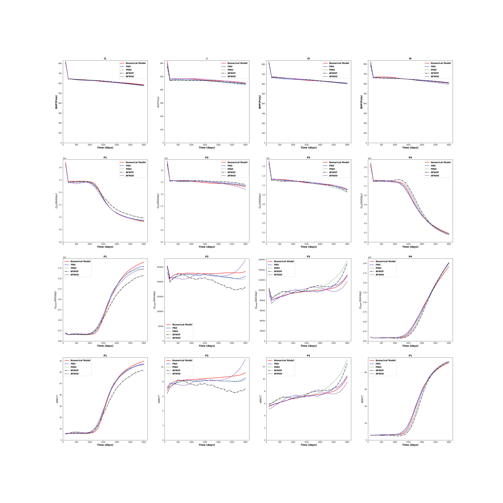
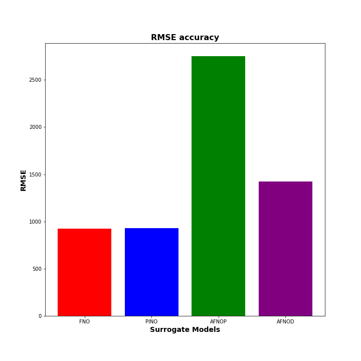
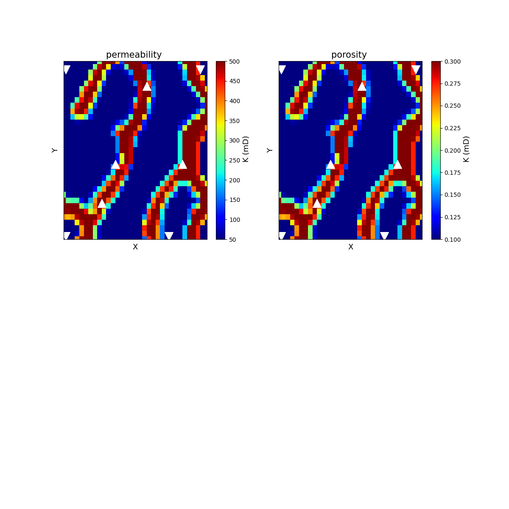
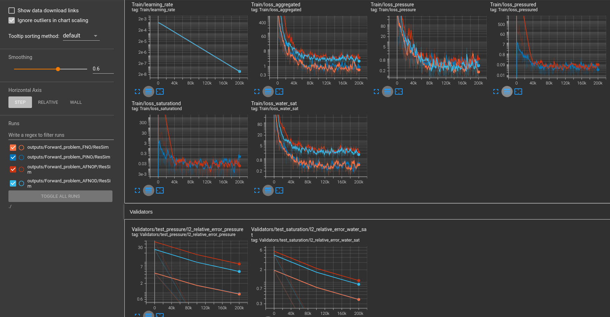

# Reservoir Simulation Forward Modelling with a Physics Informed Neural Operator (PINO) - 2D Implementation 


## An AI enabled Automatic History Matching Workflow with a PINO based forward solver:
Reservoir model calibration is applicable and relevant for locating new hydrocarbon deposits and for CCUS stratigraphic trapping initiatives in many energy companies. Energy companies are aiming to accelerate their forward simulation codes for precise and detailed subsurface/dynamic/Petro-physical mappings of their assets/plays. A fascinating and easy to implement meshless approximation to solve reservoir simulation forward problems using physics constrained/informed deep neural networks show promising results.In this project, a physics informed neural operators (PINOs) is developed for surrogating a Two phase flow black oil model .


The aim of this project is to develop an integrated workflow, where the finite volume fully/adaptive implicit black oil reservoir simulator is replaced by a phyiscs informed neural operator. This approach is well suited for forward and inverse uncertainty .


## Methods for the forward and inverse problem (In the weeds):


### Forward problem
**Black oil model**;

 - Our simplified model for two-phase flow in porous media for reservoir simulation is given as [7].
```math
\begin{equation}
φ\frac{∂S_w}{∂t} - \nabla .[T_{w} (\nabla.p_{w} + ρ_{w}gk)]= Q_{w} 
\end{equation}
```
```math
\begin{equation}
φ\frac{∂S_o}{∂t}- \nabla .[T_{o} (\nabla.p_{o} + ρ_{o} gk)]= Q_{o}     
\end{equation}
```
$`φ(x)`$ stands for the porosity,subscript $`w`$ stands for water and subscript $`o`$ stands for oil. $`T_{o},T_{w},T`$ stands for the transmissibilities, which are known functions of the permeability $`K`$ and the water saturation $`S_w`$. The system is closed by adding two additional equations

```math
\begin{equation}
P_{cwo} = p_o- p_w  ; S_w+ S_o=1. 
\end{equation}
``` 
This gives four unknowns
```math
\begin{equation}
p_{o}, p_{w}, S_{w}, S_{o}
\end{equation}
``` 
Gravity effects are considered by the terms 
```math
\begin{equation}
ρ_{w}gk,ρ_{o}gk\quad Ω \subset R^{n}(n = 2, 3) 
\end{equation}
``` 
The subsequent water, oil and overall transmissibilities is given by,
```math
\begin{equation} 
T_w = \frac{K(x) K_{rw}S_w}{μ_w}  ;T_o = \frac{K(x) K_{ro}S_o}{μ_o}   ;T= T_w + T_o          
\end{equation}
``` 
The relative permeabilities $`K_{rw} (S_w ),K_{ro} (S_w )`$ are available as tabulated functions, and $`μ_w,μ_o`$ denote the viscosities of each phase. 

We define the oil flow, the water flow, and the total flow, respectively, which are measured at the well position as; 
```math
\begin{equation} 
Q = Q_{o}  + Q_{w }
\end{equation}
``` 

The final pressure and saturation equations for a two-phase oil-water flow is
```math
\begin{equation} 
- ∇ .[T∇p]=Q   
\end{equation}
```  
```math
\begin{equation}                                               
φ\frac{∂S_w}{∂t} - \nabla .[T_{w} (\nabla.p_{w}]= Q_{w} 
\end{equation}
```  
### Surrogate Forward modelling

**Fourier Neural operator based machine infused with physics constraint from black oil model ansatz**

An FNO model architecture, introduced in [54], is shown below.


The goal is to replace the Finite volume simulator with an FNO surrogate.

For the PINO reservoir modelling [2], we are interested in predicting the pressure, saturation and fluxes given any input of the absolute permeability & porosity field for the pressure and saturation equation. We will introduce an additional (vector) variable, namely flux, F, which turns Eq. (3a) into a system of equations below. 

```math
\begin{equation} 
u=∇p ;    F = T∇p ;   - ∇ · F = Q
\end{equation}
``` 

Using a mixed residual loss formulation, the pressure equation loss ansatz is expressed as,
```math
\begin{equation} 
V(F,u;T)=\int_{Ω}[(F-T∇u)^2 + (- ∇ ·F-Q)^2 ]
\end{equation}
``` 
Ω ⊂ R^n  (n = 2, 3). The discretised pressure and saturation equation loss then becomes.

```math
\begin{equation} 
V(F,u;T)_{pressure} ≈ \frac{1}{n_{s}}  (‖F-T⨀∇u‖_{2}^{2} + ‖- ∇ ·F-Q‖_{2}^{2} )       
\end{equation}
``` 
```math
\begin{equation} 
V(u,S_w;t)_{saturation} = \frac{1}{n_s}  ‖(φ \frac{∂S_w}{∂t}- ∇ .[T_{w} (∇u)])-Q_w ‖_{2}^{2}     
\end{equation}
``` 

```math
\begin{equation} 
Loss_{cfd} =V(F,u;T)_{pressure} + V(u,S_w;t)_{saturation}      
\end{equation}
``` 


## Getting Started:
- These instructions will get you a copy of the project up and running on your local machine for development and testing purposes. 
- The code is developed in a Linux enviroment.

To run the example, launch the Modulus container using below:
```bash
docker run --rm --shm-size=1g --ulimit memlock=-1 --ulimit stack=67108864 --runtime nvidia -v ${PWD}:/examples -it nvcr.io/nvidia/modulus/modulus:23.08
```
Next, clone the repo to get this example using:
```bash
cd /examples
git lfs install
git lfs clone https://github.com/NVIDIA/modulus-sym.git
```
Install the additional dependencies using the provided `requirements.txt` using:
```
cd /examples/modulus-sym/reservoir_simulation/2D/
pip install -r requirements.txt
```

#### Forward problem

- Navigate to the example directory via terminal.

```bash
cd /examples/reservoir_simulation/2D/
```
- Run the Forward Problem surrogation with PINO/FNO/PINO2/PINO3 via the **src** folder.

- **PINO 2 & PINO3 are the original implemenation from the paper [link](https://arxiv.org/pdf/2111.03794.pdf) where PINO3 has an added output of the overall Flux ( x & y direction) and water Flux (x & y direction) as added outputs**

##### RUN
```bash
cd src
python Forward_problem_PINO.py
or
python Forward_problem_FNO.py
or
python Forward_problem_PINO2.py
or
python Forward_problem_PINO3.py
cd ..
```

- Forward problem solution results are found in the root directory folder **outputs**

- Compare the surrogate solution from **FNO** or **PINO** with the finite volume reservoir simulator (**NVRS**) from the **src** folder.

- Take note of the surrogate method (FNO or PINO) used in the prior step to avoid throwing an error.

##### RUN
```bash
cd src
python Compare_FVM_Surrogate.py
cd ..
```


- Results for the comparison are found in the root directory folder **COMPARE_RESULTS**

- Convert the images to movie for dynamic well properties visualisation (pressure and saturation fields) from the **src** folder


## Pretrained models

- Pre-trained models and all necessary files are provided in the script for rapid prototyping & reproduction

- The Inverse_problem.py/Compare_FVM_Surrogate.py scripts can be ran without necessary running the forward problem steps.

## Setting up Tensorboard
Tensorboard is a great tool for visualization of machine learning experiments. To visualize the various training and validation losses, Tensorboard can be set up as follows:

- In a separate terminal window, navigate to the working directory of the forward problem run)

- Type in the following command on the command line:

##### RUN
```bash
cd src
tensorboard --logdir=./ --port=7007
```


-Specify the port you want to use. This example uses 7007. Once running, the command prompt shows the url that you will use to display the results.

- To view results, open a web browser and go to the url shown by the command prompt. An example would be: http://localhost:7007/#scalars. A window as shown in Fig. 6 should open up in the browser window.

## Results
### Summary of Numerical Model
The result for the Psurrogate is shown in Fig.2(a-d), 500 training samples was used were we compute the data loss and physics loss. The water flows from the injectors (downwards facing arrows) towards the producers (upwards facing arrows). The size of the reservoir computational voxel is nx, ny, nz = 33,33,1. Two phases are considered (oil and water) and the wells (4 injectors and 4 producers) are arranged in an “analogous 5- spot pattern” as shown in bottom-right of Fig. 4. The 4 producers well have measurable quantities of oil rate, water rate, water-cut as and are controlled by bottom-hole-pressure. The 4 water injector wells have measurable quantity of bottom hole pressure (BHP), controlled by injection rates. The reservoir is a sandstone channelised reservoir consisting of 2 lithofacies. 2,340 days of simulation are simulated. The left column of Fig.2(a-d) are the responses from the surrogate, the middle column are the responses from the finite volume solver with AMG (pressure solve) + GMRES(ILU(0)(saturation solve)) and the right column is the difference between each response. For all panels in Fig. 2(a-d), the first row is for the pressure, the second row is for the water saturation and the third row is for the gas saturation

- The results from the Forward Problem using the 4 surrogates is shown below

|         FNO             | PINO            |
| --------------------|---------------------|
| ![Image 1][img1]     | ![Image 2][img2]     |
| **Figure 2(a) - Numerical implementation of Reservoir forward simulation. FNO based reservoir forwarding showing the 3D permeability and saturation fields with well locations**  | **Figure 2(b) - Numerical implementation of Reservoir forward simulation. PINO based reservoir forwarding showing the 3D permeability and saturation fields with well locations**  |
| --------------------|---------------------|
|         **AFNOD**             | **AFNOP**            |
| ![Image 3][img3]     | ![Image 4][img4] |
| **Figure 2(c) - Numerical implementation of Reservoir forward simulation. Data driven AFNO based reservoir forwarding showing the 3D permeability and saturation fields with well locations.**  |**Figure 2(d) - Numerical implementation of Reservoir forward simulation. Fphysics + Data driven AFNO based reservoir forwarding showing the 3D permeability and saturation fields with well locations  |

[img1]: COMPARE_RESULTS/FNO/Evolution.gif "Numerical implementation of Reservoir forward simulation. FNO based reservoir forwarding showing the 3D water saturation evolution with well locations"
[img2]: COMPARE_RESULTS/PINO/Evolution.gif "Numerical implementation of Reservoir forward simulation. PINO based reservoir forwarding showing the 3D oil saturation evolution with well locations"
[img3]: COMPARE_RESULTS/AFNOD/Evolution.gif "Numerical implementation of Reservoir forward simulation. PINO based reservoir forwarding shwoing the field pressure evolution with well locations."
[img4]: COMPARE_RESULTS/AFNOP/Evolution.gif "Numerical implementation of Reservoir forward simulation. PINO based reservoir forwarding shwoing the field pressure evolution with well locations."


|         FNO             | PINO            |
| --------------------|---------------------|
| ![Image 1][img5]     | ![Image 2][img6]     |
| **Figure 3(a) -   FNO- Pressure and water saturation R2 and L2 accuracy for the time steps**  | **Figure 3(b) - PINO- Pressure and water saturation R2 and L2 accuracy for the time steps**  |
| --------------------|---------------------|
|         **AFNOD**             | **AFNOP**            |
| ![Image 3][img7]     | ![Image 4][img8] |
| **Figure 3(c) - Data driven AFNO- Pressure and water saturation R2 and L2 accuracy for the time steps.**  |**Figure 3(d) - Data + Physics driven AFNO- Pressure and water saturation R2 and L2 accuracy for the time steps**  |

[img5]: COMPARE_RESULTS/FNO/R2L2.png "Numerical implementation of Reservoir forward simulation. FNO based reservoir forwarding showing the 3D water saturation evolution with well locations"
[img6]: COMPARE_RESULTS/PINO/R2L2.png "Numerical implementation of Reservoir forward simulation. PINO based reservoir forwarding showing the 3D oil saturation evolution with well locations"
[img7]: COMPARE_RESULTS/AFNOD/R2L2.png "Numerical implementation of Reservoir forward simulation. PINO based reservoir forwarding shwoing the field pressure evolution with well locations."
[img8]: COMPARE_RESULTS/AFNOP/R2L2.png "Numerical implementation of Reservoir forward simulation. PINO based reservoir forwarding shwoing the field pressure evolution with well locations."


*Figure 4(a): Production profile comparison. (red) True model and the 4 surrogates (FNO/PINO/AFNO/AFNOD) (blue) PINO model. First row is for the bottom-hole-pressure of well injectors (I1-I4), second row is for the oil rate production for the well producers (P1-P4), third row is for the water rate production for the well producers (P1-P4) and the last row is for the water cut ratio of the 4 well producers (P1-P4)*

*Figure 4(b): RMSE values showng the 4 surrogates*


*Figure 5: Permeability and porosity fields*


*Figure 6: The tensorboard output of the Run from the PINO experiment(blue) and FNO experiment (orange)*


## Release Notes

**23.03**
* Increase degree of freedom in the number of injector and producer well configuration.
* Weighted scheme during the Kalman gain computation for the aREKI update.
* Diffusion model adjusted and implemented.
* 3D well plots with injection and producer wells animations/movie.
* Variation convolution autoencoder better implemented.
* 2 new PINO implementation accounting for the Overall Flux and water specific flux during the pde loss computation.
* Experimental gradient based method implementd with Adam & LBFGS for comparison purposes only to the aREKI scheme.
* Sensible initial ensemble initialisation from MPS and 6 new training images (TI's).
* Constrained presure residual method for the fully/adaptive implict finitie volume numerical solver implemented. This method has a 2 stage V cyclec AMG, with the coarsening, aggregation, colouring & level-scheduling implemented during the restrcition operation. SOR, Gauss-Seidel, Jacobi implemented during the smoothing operation. The solution from the pressure solve serves as an initialiser for the saturation solver, which is a left-preconditioned GMRES with an ILU(0) preconditoner. 

**23.02**
* Bug Fixes

**23.01**
* First release 

## References:
[1] J.-Y. Zhu, R. Zhang, D. Pathak, T. Darrell, A. A. Efros, O. Wang, E. Shechtman, Toward multimodal image-to-image translation, in Advances in Neural Information Processing Systems, 2017, pp. 465–476.

[2] S. Rojas, J. Koplik, Nonlinear flow in porous media, Phys. Rev. E 58 (1998) 4776–4782.doi:10.1103/PhysRevE.58.4776.URL,https://link.aps.org/doi/10.1103/PhysRevE.58.4776

[3] I. Goodfellow, J. Pouget-Abadie, M. Mirza, B. Xu, D. Warde-Farley, S. Ozair, A. Courville, Y. Bengio, Generative adversarial nets, in: Z. Ghahramani, M. Welling, C. Cortes, N. D. Lawrence, K. Q. Weinberger (Eds.), Advances in Neural Information Processing Systems 27, Curran Associates, Inc., 2014, pp. 2672–2680. URL http://papers.nips.cc/paper/5423-generative-adversarial-nets. pdf

[4] M. Raissi, P. Perdikaris, G. Karniadakis, Physics-informed neural networks: A deep learning framework for solving forward and inverse problems involving nonlinear partial differential equations, Journal of Computational Physics 378 (2019) 686 – 707. doi:https://doi.org/10.1016/j.jcp.2018.10.045.URL,http://www.sciencedirect.com/science/article/pii/ S0021999118307125

[5] M. Raissi, Forward-backward stochastic neural networks: Deep learning of high-dimensional partial differential equations, arXiv preprint arXiv:1804.07010

[6] M. Raissi, P. Perdikaris, G. E. Karniadakis, Physics Informed Deep Learning (Part I): Data-driven solutions of nonlinear partial differential equations, arXiv preprint arXiv:1711.10561

[7] Bishop. Christopher M 2006. Pattern Recognition and Machine Learning (Information Science and Statistics). Springer-Verlag, Berlin, Heidelberg.


[8] Zongyi Li, Nikola Kovachki, Kamyar Azizzadenesheli, Burigede Liu, Kaushik Bhattacharya, Andrew Stuart, Anima Anandkumar. Fourier Neural Operator for Parametric Partial Differential Equations. https://doi.org/10.48550/arXiv.2010.088959] Zongyi Li, Hongkai Zheng, Nikola Kovachki, David Jin, Haoxuan Chen, Burigede Liu, Kamyar Azizzadenesheli, Anima Anandkumar.Physics-Informed Neural Operator for Learning Partial Differential Equations. https://arxiv.org/pdf/2111.03794.pdf

