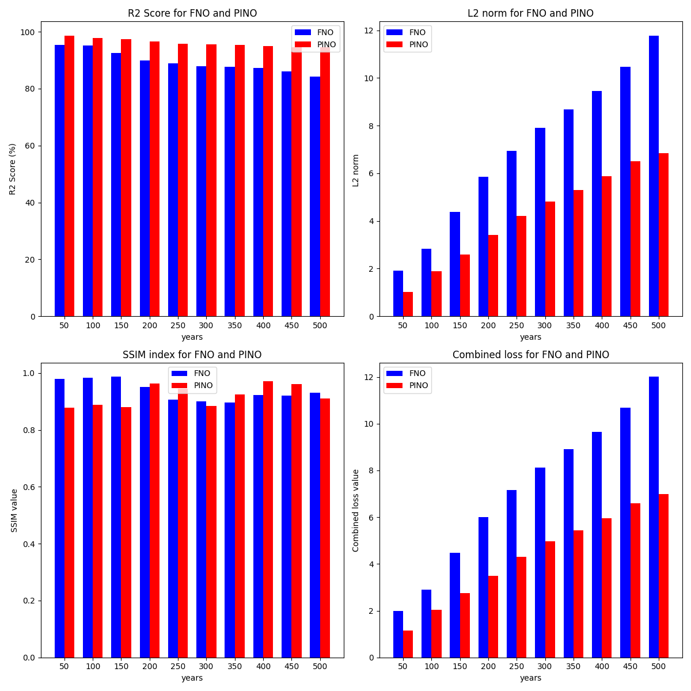
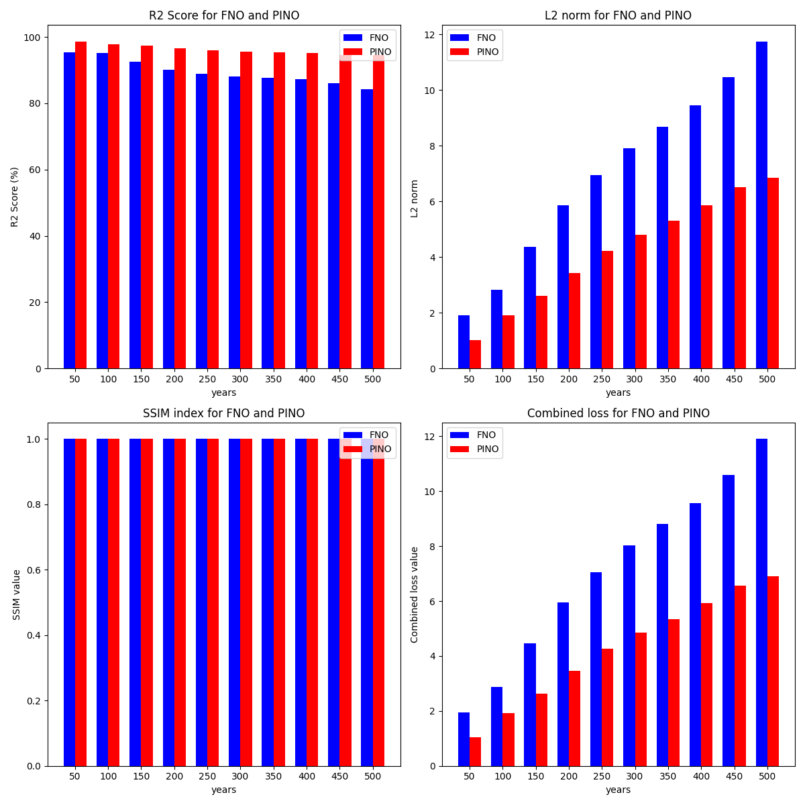
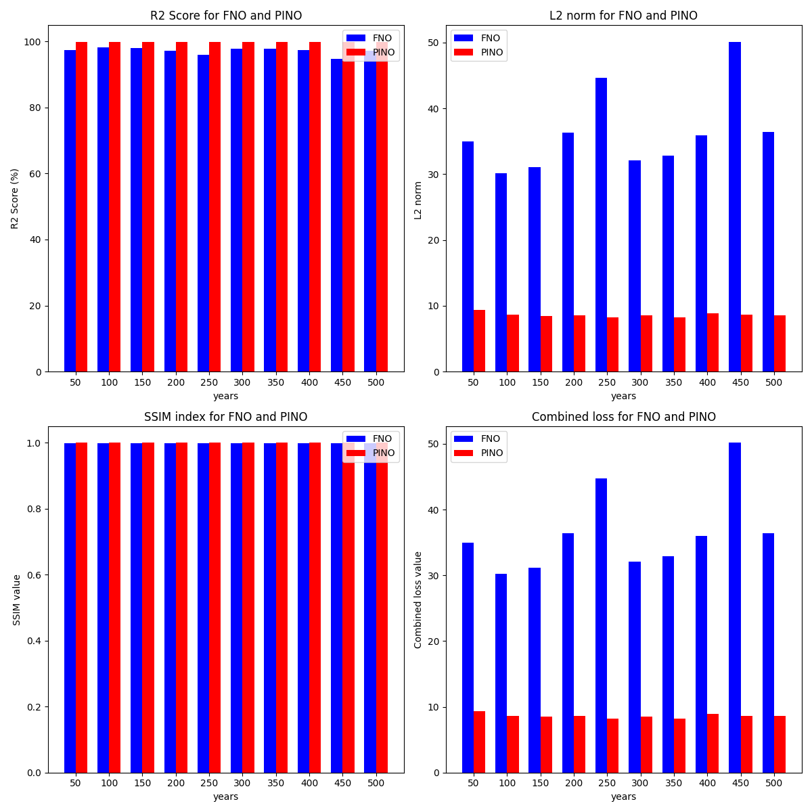
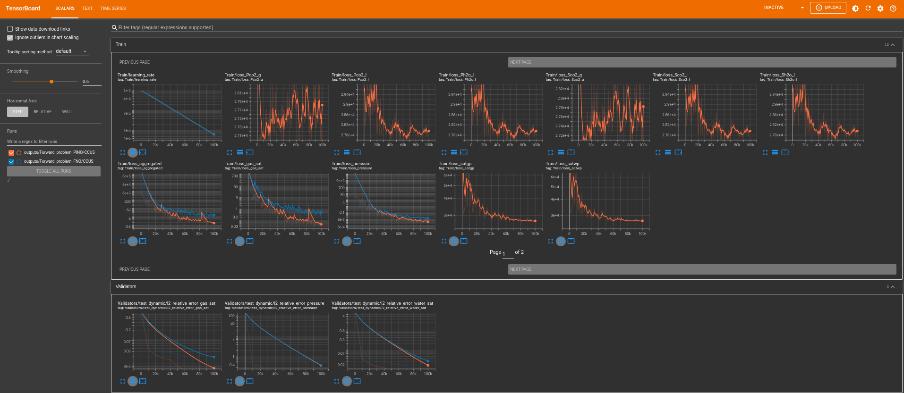
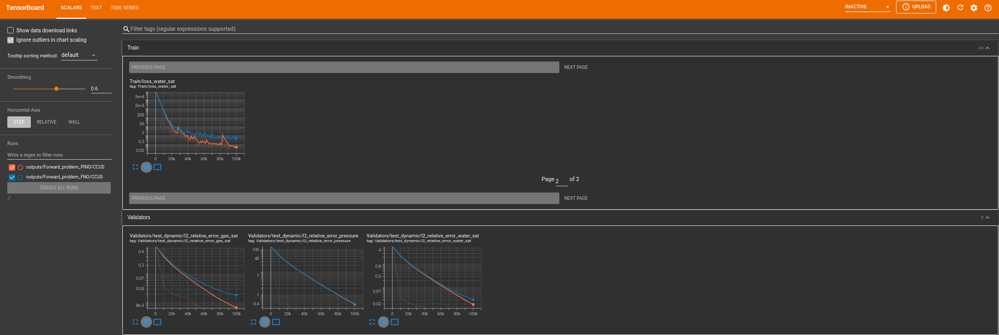

<!-- markdownlint-disable -->
# <b>A Modulus based CO<sub>2</sub>-Brine Physics constrained Neural Operator Forward Model</b>

## **Forward problem**


The forward problem for a CO<sub>2</sub>-Brine system is given by. 

```math
\begin{equation}
\phi \frac{\partial}{\partial t} \left( \sum_{l} \rho_l y_{cl} S_l \right) - \nabla \cdot \mathbf{k} \left( \sum_{l} \rho_l y_{cl} \lambda_l u_l \right) - \sum_{l} \rho_l y_{cl} q_l = 0

\end{equation}
```

```math
\begin{equation}
u_l = -k\lambda_l \nabla\Theta_l = -k\lambda_l \left( \nabla(p - P_{cl}) - \rho_l g\nabla z \right)
\end{equation}
```

```math
\begin{equation}
\lambda_l = \frac{K_{rl}}{\mu_l}
\end{equation}
```

```math
\begin{equation}
\phi \frac{\partial}{\partial t} \left( \sum_{l} \rho_l y_{cl} S_l \right) - \nabla \cdot k \left( \sum_{l} \rho_l y_{cl} \lambda_l \nabla\Theta_l \right) - \sum_{l} \rho_l y_{cl} q_l = 0
\end{equation}
```

Where: $`l`$ is the phase (brine/gas), $`k`$ is the rock absolute permeability, $`\lambda_l`$ is the phase mobility ratio, $`\mu_l`$ is the phase viscosity, $`K_{rl}`$ is the phase relative permeability, $`S_l`$ is the phase saturation, $`u_l`$ is the phase Darcy velocity, $`g`$ is the acceleration due to gravity, $`z`$ is the depth, $`y_{c,l}`$ is the mass fraction of component $`c`$ in phase $`l`$, $`t`$ is time, and $`p`$ is the pressure.

The system is closed by assuming,
```math
\begin{equation}
\sum_{l} S_l = 1, \quad Z_c = \frac{\rho_c}{\rho_T}, \quad \rho_T = \sum_{c} \rho_c
\end{equation}
```


```math
\begin{equation}
S_l = v_l \frac{\rho_T}{\rho_l}, \quad S_g = v_g \frac{\rho_T}{\rho_g}
\end{equation}
```

### **Thermodynamic Equations** 
The CO$`_2`$-brine model includes two components (CO$`_2`$ and H$`_2`$O) that are transported by one or two fluid phases (the brine phase and the CO$`_2`$ phase). We refer to the brine phase with the subscript $`l`$ and to the CO$`_2`$ phase with the subscript $`g`$ (although the CO$`_2`$ phase can be in supercritical, liquid, or gas state). The water component is only present in the brine phase, while the CO$`_2`$ component can be present in the CO$`_2`$ phase as well as in the brine phase. Thus, considering the molar phase component fractions, $`y_{c,p}`$ (i.e., the fraction of the molar mass of phase $`p`$ represented by component $`c`$).

The update of the fluid properties is done in two steps:

1) The phase fractions ($`v_p`$) and phase component fractions ($`y_{c,p}`$) are computed as a function of pressure ($`p`$), temperature ($`T`$), component fractions ($`z_c`$), and a constant salinity.
2) The phase densities ($`\rho_p`$) and phase viscosities ($`\mu_p`$) are computed as a function of pressure, temperature, the updated phase component fractions, and a constant salinity.


Note that the current implementation of the flow solver is isothermal and that the derivatives to temperature are therefore discarded.

The models that are used in steps 1) and 2) are reviewed in more detail below.


#### **Computation of the phase fractions and phase component fractions (flash)** 
We compute the values of CO$`_2`$ solubility in brine as a function of pressure, temperature, and a constant salinity. We note the pressure ($`p`$) and temperature ($`T`$):

Note that the pressures are in Pascal, temperatures are in Kelvin, and the salinity is a molality (moles of NaCl per kg of brine). The temperature must be between 283.15 and 623.15 Kelvin. We solve the following nonlinear CO$`_2$ equation of state (Duan and Sun, 2003) for each pair to obtain the reduced volume as,

```math
\begin{equation}
Z = \left( \frac{p_r V_r}{T_r} \right) = 1 + \frac{ (a_1 + \frac{a_2}{T_r^2} + \frac{a_3}{T_r^3})}{V_r} + \frac{(a_4 + \frac{a_5}{T_r^2} + \frac{a_6}{T_r^3})}{(V_r^2)} + \frac{(a_7 + \frac{a_8}{T_r^2} + \frac{a_9}{T_r^3})}{(V_r^4)} + \frac{(a_{10} + \frac{a_{11}}{T_r^2} + \frac{a_{12}}{T_r^3})}{(V_r^5)} + \frac{a_{13}}{(T_r^3 V_r^2)} \left( a_{14} + a_{15} \left( \frac{1}{V_r^2} \right) \right) \exp \left( -a_{15} \left( \frac{1}{V_r^2} \right) \right)
\end{equation}
```

Where $`p_r = \frac{p}{p_{crit}}`$ is the reduced pressure and the reduced temperature $`T_r = \frac{T}{T_{crit}}`$. The coefficients $`a_1, a_2, \ldots, a_{15}`$ are given as:

$`a_1 = 8.99288497 \times 10^{-2}`$, $`a_2 = -4.94783127 \times 10^{-1}`$, $`a_3 = 4.77922245 \times 10^{-2}`$, $`a_4 = 1.03808883 \times 10^{-2}`$, $`a_5 = -2.82516861 \times 10^{-2}`$, $`a_6 = 9.49887563 \times 10^{-2}`$, $`a_7 = 5.20600880 \times 10^{-4}`$, $`a_8 = -2.93540971 \times 10^{-4}`$, $`a_9 = -1.77265112 \times 10^{-3}`$, $`a_{10} = -2.51101973 \times 10^{-5}`$, $`a_{11} = 8.93353441 \times 10^{-5}`$, $`a_{12} = 7.88998563 \times 10^{-5}`$, $`a_{13} = -1.66727022 \times 10^{-2}`$, $`a_{14} = 1.39800000`$, $`a_{15} = 2.96000000 \times 10^{-2}`$.

Using the reduced volume, $`V_r`$, we compute the fugacity coefficient of CO$`_2`$,

```math
\begin{equation}
\ln \phi (T,P) = Z - 1 - \ln Z + \frac{(a_1 + \frac{a_2}{T_r^2} + \frac{a_3}{T_r^3})}{V_r} + \frac{(a_4 + \frac{a_5}{T_r^2} + \frac{a_6}{T_r^3})}{(2V_r^2)} + \frac{(a_7 + \frac{a_8}{T_r^2} + \frac{a_9}{T_r^3})}{(4V_r^4)} + \frac{(a_{10} + \frac{a_{11}}{T_r^2} + \frac{a_{12}}{T_r^3})}{(5V_r^5)} + \frac{a_{13}}{(2T_r^3 V_r^2)} \left[ a_{14} + 1 - \left( a_{14} + 1 + \frac{a_{15}}{(V_r^2)} \right) \right] \exp \left( -\frac{a_{15}}{(V_r^2)} \right)
\end{equation}
```

To conclude, we use the fugacity coefficient of CO$`_2`$ to compute and store the solubility of CO$`_2`$ in brine, $`s_{\text{CO}_2}`$,

```math
\begin{equation}
\ln \frac{y_{\text{CO}_2}}{s_{\text{CO}_2}} P = \frac{\Phi_{\text{CO}_2}}{RT} - \ln \phi (T,P) + \sum_{c} 2\lambda_c m + \sum_{a} 2\lambda_a m + \sum_{(a,c)} \xi_{(a,c)} m^2
\end{equation}
```

Where $`\Phi_{\text{CO}_2}`$ is the chemical potential of the CO$`_2`$ component, $`R`$ is the gas constant, and $`m`$ is the salinity. The mole fraction of CO$`_2`$ in the vapor phase, $`y_{\text{CO}_2} = \left( \frac{p - p_{\text{H}_2\text{O}}}{p} \right)`$.

Then, we compute the phase fractions as:
```math
\begin{equation}
v_l = \frac{(1 + s_{\text{CO}_2})}{\left( 1 + \frac{z_{\text{CO}_2}}{(1-z_{\text{CO}_2})} \right)}

\quad v_g = 1 - v_l

\end{equation}
```

We conclude by computing the phase component fractions as:
```math
\begin{equation}

y_{\text{CO}_2,l} = \frac{s_{\text{CO}_2}}{(1 + s_{\text{CO}_2})}, \quad y_{\text{H}_2\text{O},l} = 1 - y_{\text{CO}_2,l}

\quad y_{\text{CO}_2,g} = 1, \quad y_{\text{H}_2\text{O},g} = 0

\end{equation}
```


#### **Computation of the phase densities and phase viscosities**

**<u>CO<sub>2</sub></u> phase density and viscosity**


The nonlinear Helmholtz energy equation yields, 

```math
\begin{equation}
\frac{P}{(RT\rho_g)} = 1 + \psi \phi_\psi^r (\psi,\tau)
\end{equation}
```

Where, 
```math
\begin{equation}
\psi = \frac{\rho_g}{\rho_{crit}}, \quad \tau = \frac{T_{crit}}{T}
\end{equation}
```

```math
\begin{equation}
\mu_g = \mu_o (T) + \mu_{excess} (\rho_g,T)
\end{equation}
```

```math
\begin{equation}
\mu_{excess} (\rho_g,T) = d_1 \rho_g + d_2 \rho_g^2 + \frac{d_3 \rho_g^6}{T^3} + d_4 \rho_g^8 + \frac{d_5 \rho_g^8}{T}
\end{equation}
```
Where,
$`d_1 = 0.4071119 \times 10^{-2}`$ , $`d_2 = 0.7198037 \times 10^{-4}`$ , $`d_3 = 0.2411697 \times 10^{-16}`$ , $`d_4 = 0.2971072 \times 10^{-22}`$ , $`d_5 = -0.1627888 \times 10^{-22}`$ 

```math
\begin{equation}
\mu_o (T) = \frac{1.00697T^{0.5}}{B^*(T^*)}, \quad \ln B^*(T^*) = \sum_{i=0}^{4} x_i (\ln T^*)^i, \quad T^* = \omega T, \quad \omega = \frac{1}{251.196 \text{ K}}
\end{equation}
```
Where,
$`x_0 = 0.235156`$ , $`x_1 = -0.491266`$ , $`x_2 = 5.211155 \times 10^{-2}`$ , $`x_3 = 5.347906 \times 10^{-2}`$ , $`x_4 = -1.537102 \times 10^{-2}`$ 

**<u>Brine phase density and viscosity</u>**


```math
\begin{equation}
\rho_{(l,table)} = A_1 + A_2 x + A_3 x^2 + A_4 x^3
\end{equation}
```

```math
\begin{equation}
x = c_1 \exp(a_1 m) + c_2 \exp(a_2 T) + c_3 \exp(a_3 P)
\end{equation}
```

```math
\begin{equation}
\rho_l = \rho_{(l,table)} + M_{\text{CO}_2} C_{\text{CO}_2} - C_{\text{CO}_2} \rho_{(l,table)} V_\phi
\end{equation}
```

```math
\begin{equation}
C_{\text{CO}_2} = \frac{y_{\text{CO}_2,l} \rho_{(l,table)}}{M_{\text{H}_2\text{O}} (1-y_{\text{CO}_2,l})}
\end{equation}
```

```math
\begin{equation}
V_\phi = 37.51 - (T \times 9.585 \times 10^{-2}) + (T^2 \times 8.740 \times 10^{-4}) - (T^3 \times 5.044 \times 10^{-7})
\end{equation}
```

```math
\begin{equation}
\mu_l = a_z T + b_z
\end{equation}
```

```math
\begin{equation}
a_z = \mu_w (T) \times 0.000629(1 - \exp(-0.7m))
\end{equation}
```

```math
\begin{equation}
b_z = \mu_w (T)(1 + 0.0816m + 0.0122m^2 + 0.000128m^3)
\end{equation}
```


# **Physics Constrained Neural operator for the CO<sub>2</sub>-Brine case</b>**

## **2.1 Overall discretized equations loss**

The physics loss *ansatz* is then,

The physics loss ansatz is then,
```math
\begin{equation}
V(q_g,p;\lambda_g)_{\text{p},\text{CO}_2,g} = \frac{1}{n_s} \left\| \nabla \cdot k(\rho_g y_{\text{CO}_2,g} \lambda_g \nabla(p - P_{\text{CO}_2,g})) - \rho_g y_{\text{CO}_2,g} q_g \right\|_2^2
\end{equation}
```

```math
\begin{equation}
V(q_l,p;\lambda_l)_{\text{p},\text{CO}_2,l} = \frac{1}{n_s} \left\| \nabla \cdot k(\rho_l y_{\text{CO}_2,l} \lambda_l \nabla(p - P_{\text{CO}_2,l})) - \rho_l y_{\text{CO}_2,l} q_l \right\|_2^2
\end{equation}
```

```math
\begin{equation}
V(q_l,p;\lambda_l)_{\text{p},\text{H}_2\text{O},l} = \frac{1}{n_s} \left\| \nabla \cdot k(\rho_l y_{\text{H}_2\text{O},l} \lambda_l \nabla(p - P_{\text{H}_2\text{O},l})) - \rho_l y_{\text{H}_2\text{O},l} q_l \right\|_2^2
\end{equation}
```

```math
\begin{equation}
V(p,S_g;t)_{\text{g},\text{CO}_2,g} = \frac{1}{n_s} \left\| \phi \frac{\partial}{\partial t} (\rho_g y_{\text{CO}_2,g} S_g) -
\nabla \cdot k(\rho_g y_{\text{CO}_2,g} \lambda_g \nabla(p - P_{\text{CO}_2,g})) - \rho_g y_{\text{CO}_2,g} q_g \right\|_2^2
\end{equation}
```

```math
\begin{equation}
V(p,S_g;t)_{\text{g},\text{CO}_2,l} = \frac{1}{n_s} \left\| \phi \frac{\partial}{\partial t} (\rho_l y_{\text{CO}_2,l} S_l) -
 \nabla \cdot k(\rho_l y_{\text{CO}_2,l} \lambda_g \nabla(p - P_{\text{CO}_2,l})) - \rho_l y_{\text{CO}_2,l} q_l \right\|_2^2
\end{equation}
```

```math
\begin{equation}
V(p,S_l;t)_{\text{b},\text{H}_2\text{O},l} = \frac{1}{n_s} \left\| \phi \frac{\partial}{\partial t} (\rho_l y_{\text{H}_2\text{O},l} S_l) -
 \nabla \cdot k(\rho_l y_{\text{H}_2\text{O},l} \lambda_g \nabla(p - P_{\text{H}_2\text{O},l})) - \rho_l y_{\text{H}_2\text{O},l} q_l \right\|_2^2
\end{equation}
```


```math
\begin{equation}
\phi_{\text{cfd}} = V(q_g,p;\lambda_g)_{\text{p},\text{CO}_2,g} + V(q_l,p;\lambda_l)_{\text{p},\text{CO}_2,l} + V(q_l,p;\lambda_l)_{\text{p},\text{H}_2\text{O},l} + V(p,S_g;t)_{\text{g},\text{CO}_2,g} + V(p,S_g;t)_{\text{g},\text{CO}_2,l} + V(p,S_w;t)_{\text{b},\text{H}_2\text{O},l}
\end{equation}
```

```math
\begin{equation}
\phi = \phi_{\text{cfd}} + \phi_{\text{data}}
\end{equation}
```

```math
\begin{equation}
\theta = [\theta_p,\theta_s,\theta_g]^T
\end{equation}
```

```math
\begin{equation}
\theta^{(j+1)} = \theta^j - \epsilon \nabla \phi_{\theta}^j
\end{equation}
```


## **2.2 Pseudocode**

**Algorithm 1: PINO CO<sub>2</sub>-Brine Reservoir simulator**

**Input:**  
$`X_1=\{K,\phi\}\in\mathbb{R}^{B_0\times1\times D\times W\times H}`$,  
$`X_{N1}=\{q_l,q_g,dt\}\in\mathbb{R}^{B_0\times T\times D\times W\times H}`$  
$`Y_{pt}`$ -- labelled pressure  
$`Y_{lt}`$ -- labelled water saturation  
$`Y_{gt}`$ -- labelled gas saturation  
$`f_1(:,\theta_p)`$,  
$`f_2(:,\theta_l)`$,  
$`f_3(:,\theta_g)`$,  
$`T`$ -- Time  
epoch, tol, $`w_1,w_2,w_3,w_4,w_5,w_6, \epsilon`$

$`j = 0`$  
**while** $`(j \leq \text{epoch})`$ **or** $`(\phi \leq \text{tol})`$ **do**  
$`\quad Y_{0p}=f_1(X_1;\theta_p), Y_{0s}=f_2(X_1;\theta_l), Y_{0g}=f_3(X_1;\theta_g)`$  
$`\quad`$Compute: $`v_l,v_g,y_{\text{CO}_2,l},y_{\text{CO}_2,g},y_{H_2 O,l},y_{H_2 O,g}`$  using Eqn. (5-9)  
$`\quad`$Compute: $`\rho_g,\rho_l,\mu_g,\mu_l`$  using Eqn. (10-14)  
$`\quad`$Compute: $`Z_c=  \rho_c/\rho_T`$  
$`\quad`$Compute: $`\rho_T= \sum_c\rho_c`$  
$`\quad`$Compute: $`\text{S}_l^*= v_l \rho_T/\rho_l$, $\text{S}_g^*= v_g \rho_T/\rho_g`$  
$`\quad`$Compute: $`\phi_l^*= \|Y_{1st}-\text{S}_l^*\|_2^2`$  
$`\quad`$Compute: $`\phi_g^*= \|Y_{1gt}-\text{S}_g^*\|_2^2`$  
$`\quad`$Compute:   
$`\quad\quad V(q_g,p;\lambda_g)_{\text{p},\text{CO}_2,g} =\frac{1}{n_s}  \left\|\nabla.k(\rho_g y_{\text{CO}_2,g} \lambda_g \nabla(p- P_{\text{CO}_2,g}))-\rho_g y_{\text{CO}_2,g} q_g\right\|_2^2`$  
$`\quad`$Compute:   
$`\quad\quad V(q_l,p;\lambda_l)_{\text{p},\text{CO}_2,l} =\frac{1}{n_s}  \left\|\nabla.k(\rho_l y_{\text{CO}_2,l} \lambda_l \nabla(p- P_{\text{CO}_2,l}))-\rho_l y_{\text{CO}_2,l} q_l\right\|_2^2`$  
$`\quad`$Compute:   
$`\quad\quad V(q_l,p;\lambda_l)_{\text{p},H_2 O,l} =\frac{1}{n_s}  \left\|\nabla.k(\rho_l y_{H_2 O,l} \lambda_l \nabla(p- P_{H_2 O,l}))-\rho_l y_{H_2 O,l} q_l\right\|_2^2`$  
$`\quad`$Compute:   
$`\quad\quad V(p,S_g;t)_{\text{g},\text{CO}_2,g} =\frac{1}{n_s}  \left\|\phi \frac{\partial}{\partial t}(\rho_g y_{\text{CO}_2,g} S_g) - \nabla.k(\rho_g y_{\text{CO}_2,g} \lambda_g \nabla(p- P_{\text{CO}_2,g}))-\rho_g y_{\text{CO}_2,g} q_g\right\|_2^2`$  
$`\quad`$Compute:   
$`\quad\quad V(p,S_g;t)_{\text{g},\text{CO}_2,l} =\frac{1}{n_s}  \left\|\phi \frac{\partial}{\partial t}(\rho_l y_{\text{CO}_2,l} S_l) - \nabla.k(\rho_l y_{\text{CO}_2,l} \lambda_g \nabla(p- P_{\text{CO}_2,l}))-\rho_l y_{\text{CO}_2,l} q_l\right\|_2^2`$  
$`\quad`$Compute:   
$`\quad\quad V(p,S_l;t)_{\text{b},H_2 O,l} =\frac{1}{n_s}  \left\|\phi \frac{\partial}{\partial t}(\rho_l y_{H_2 O,l} S_l) - \nabla.k(\rho_l y_{H_2 O,l} \lambda_g \nabla(p- P_{H_2 O,l}))-\rho_l y_{H_2 O,l} q_l\right\|_2^2`$  
$`\quad\phi_p= \|Y_{pt}-f_1(X_1;\theta_p)\|_2^2`$  
$`\quad\phi_s= \|Y_{lt}-f_2(X_1;\theta_l)\|_2^2`$  
$`\quad\phi_g= \|Y_{gt}-f_3(X_1;\theta_g)\|_2^2`$ 

$`\phi = w_1\phi_p + w_2\phi_s + w_3\phi_g + w_4\phi_l^* + w_5\phi_g^*\\\\\\
\quad + w_6 V(q_g,p;\lambda_g)_{\text{p},\text{CO}_2,g}\\\\\\
\quad + w_7 V(q_l,p;\lambda_l)_{\text{p},\text{CO}_2,l}\\\\\\
\quad + w_8 V(p,S_g;t)_{\text{g},\text{CO}_2,g}\\\\\\
\quad + w_9 V(q_l,p;\lambda_l)_{\text{p},H_2 O,l}\\\\\\
\quad + w_{10} V(p,S_g;t)_{\text{g},\text{CO}_2,l}\\\\\\
\quad + V(p,S_l;t)_{\text{b},H_2 O,l}`$  


$`\quad`$**Update models:**  
$`\quad\theta= [\theta_p,\theta_l,\theta_g]^T`$  
$`\quad\theta^{(j+1)}=\theta^j-\epsilon\nabla\phi_{\theta}^j`$  
$`\quad j \leftarrow j+ 1`$  

**Output:** $`f_1(:,\theta_p),f_2(:,\theta_l),f_3(:,\theta_g)`$


$`w_1`$ , $`\ldots`$ , $`w_{10}`$  $`\text{ are the weights associated with the loss functions corresponding to the 10 terms. }`$ . $`X_0=\{k,\phi\} \in \mathbb{R}^{(B_0 \times 1 \times D \times W \times H)}`$  $`\text{ are the dictionary inputs. }`$  $`\text{epoch}`$ , $`\text{tol}`$  $`\text{ are the number of epochs and the tolerance level for the loss function. }`$ . $`f_1(:,\theta_p)`$ , $`f_2(:,\theta_l)`$ , $`f_3(:,\theta_g)`$  $`\text{ are the FNO models for the pressure, brine saturation, and gas saturations respectively.}`$ 


## Important Dependencies & Prerequisites:
- Nvidia's Modulus symbolic v23.09 :[link](https://github.com/NVIDIA/modulus-sym)
- CUDA 11.8 : [link](https://developer.nvidia.com/cuda-11-8-0-download-archive)
- CuPy : [link](https://github.com/cupy/cupy.git)
- Python 3.8 upwards

## Getting Started:
- These instructions will get you a copy of the project up and running on your local machine for development and testing purposes. 
- The code is developed in a Linux enviroment.

## Installation - Bare metal / Docker

- From terminal create a new conda enviroment named **MDLO** (check if conda is installed) .
```bash
conda create --name MDLO python=3.8
```

Clone this code base repository in a dedicated **work folder**.
```bash
cd **work folder**
conda activate MDLO
git lfs clone https://github.com/NVIDIA/modulus-sym.git
```
### Bare-metal
- From terminal do these sequence of operations to install Modulus v23.09: [link](https://github.com/NVIDIA/modulus-sym.git)
```bash
pip install nvidia-modulus.sym
             
```
- From terminal, install (missing) dependencies in 'requirements.txt' in the conda enviroment **MDLO**
- Follow instructions to install CuPy from : [link](https://github.com/cupy/cupy.git)


### Docker (Recommended)
- You may need to temporarily deactivate any **vpn** for the docker installation & run
- Note, NVIDIA Container Toolkit must be installed first. This extension enables Docker daemon to treat GPUs properly.

- Please follow the installation instructions in [link](https://docs.nvidia.com/datacenter/cloud-native/container-toolkit/install-guide.html).

If you encounter a **Conflicting values set for option Signed** error when running apt update as shown below,

```bash
sudo apt-get update
E: Conflicting values set for option Signed-By regarding source https://nvidia.github.io/libnvidia-container/stable/ubuntu18.04/amd64/ /: /usr/share/keyrings/nvidia-container-toolkit-keyring.gpg !=
E: The list of sources could not be read.
```
Do the following
```bash
grep "nvidia.github.io" /etc/apt/sources.list.d/*
grep -l "nvidia.github.io" /etc/apt/sources.list.d/* | grep -vE "/nvidia-container-toolkit.list\$"
```
Delete the file(s) that will be shown from running the command above
```bash
sudo rm -f FILENAME
```
where FILENAME is the name of the file(s) shown above

More Troubleshooting can be found at [link](https://docs.nvidia.com/datacenter/cloud-native/container-toolkit/troubleshooting.html)

```bash
# enable shell script execution.
sudo chmod +x ./scripts/docker/docker-build.sh
sudo chmod +x set_env.sh
# Build docker image
./scripts/docker/docker-build.sh

# enable shell script execution.
sudo chmod +x ./scripts/docker/docker-run.sh
# Run docker container (also enables X server for docker)
./scripts/docker/docker-run.sh
```


### Run
**OPM Flow** is a fully CPU based Black oil reservoir simulator.

[link](https://opm-project.org/?page_id=19 )

#### Forward problem


- Navigate to the code base root directory - **work folder** via terminal.

##### Bare Metal alone
```bash
cd **work folder**
```
- where **work folder** is the location you downloaded the code base to.

- Download the supplemental material.

- Run the Forward Problem surrogation with PINO  via the **src** folder.

##### Bare Metal
```bash
conda activate MDLO 
wget --content-disposition https://api.ngc.nvidia.com/v2/resources/nvidia/modulus/modulus_reservoir_simulation_supplemental_material/versions/latest/zip -O modulus_reservoir_simulation_supplemental_material_latest.zip
unzip modulus_reservoir_simulation_supplemental_material_latest.zip
unzip modulus_reservoir_simulation_norne_supplemental_material.zip
cp -r modulus_reservoir_simulation_norne_supplemental_material/* .
cd src
python Forward_problem_PINO.py
python Forward_problem_FNO.py

cd ..
conda deactivate
```

##### Docker
```bash
wget --content-disposition https://api.ngc.nvidia.com/v2/resources/nvidia/modulus/modulus_reservoir_simulation_supplemental_material/versions/latest/zip -O modulus_reservoir_simulation_supplemental_material_latest.zip
unzip modulus_reservoir_simulation_supplemental_material_latest.zip
unzip modulus_reservoir_simulation_norne_supplemental_material.zip
cp -r modulus_reservoir_simulation_norne_supplemental_material/* .
cd src
python Forward_problem_PINO.py
python Forward_problem_FNO.py

cd ..
```


- Forward problem solution results are found in the root directory folder **outputs**

- Compare the surrogate solution from **PINO** with the finite volume reservoir simulator (**NVRS**) from the **src** folder.


##### Bare Metal
```bash
conda activate MDLO
wget --content-disposition https://api.ngc.nvidia.com/v2/resources/nvidia/modulus/modulus_reservoir_simulation_supplemental_material/versions/latest/zip -O modulus_reservoir_simulation_supplemental_material_latest.zip
unzip modulus_reservoir_simulation_supplemental_material_latest.zip
unzip modulus_reservoir_simulation_norne_supplemental_material.zip
cp -r modulus_reservoir_simulation_norne_supplemental_material/* .
cd src
python Compare_FVM_Surrogate.py
cd ..
conda deactivate
```

##### Docker
```bash
wget --content-disposition https://api.ngc.nvidia.com/v2/resources/nvidia/modulus/modulus_reservoir_simulation_supplemental_material/versions/latest/zip -O modulus_reservoir_simulation_supplemental_material_latest.zip
unzip modulus_reservoir_simulation_supplemental_material_latest.zip
unzip modulus_reservoir_simulation_norne_supplemental_material.zip
cp -r modulus_reservoir_simulation_norne_supplemental_material/* .
cd src
python Compare_FVM_Surrogate.py
cd ..
```

- Results for the comparison are found in the root directory folder **COMPARE_RESULTS**

## Setting up Tensorboard
Tensorboard is a great tool for visualization of machine learning experiments. To visualize the various training and validation losses, Tensorboard can be set up as follows:

- In a separate terminal window, navigate to the working directory of the forward problem run)

- Type in the following command on the command line:

##### Bare Metal
```bash
conda activate MDLO
cd src
tensorboard --logdir=./ --port=7007
```

##### Docker
```bash
cd src
tensorboard --logdir=./ --port=7007
```


-Specify the port you want to use. This example uses 7007. Once running, the command prompt shows the URL that you will use to display the results.

- To view results, open a web browser and go to the URL shown by the command prompt. An example would be http://localhost:7007/#scalars. A window as shown in Fig. 10 should open up in the browser window.


## Results
### Summary of Numerical Model
The result for the PINO and FNO surrogate is shown in Fig.1(a & b), 500 training samples were used where we computed the data loss and physics loss. The size of the reservoir computational voxel is nx, ny, nz = 50,50,10. Two phases are considered (CO$`_2`$ and brine) having only 1 CO$`_2`$ injector. 500 years of simulation are simulated. The left column of Fig.1(a & b) contains the responses from the PINO and FNO surrogate, the middle column is the responses from the Flow finite volume solver  and the right column is the difference between each response. For all panels in Fig. 1(a & b), the first row is for the pressure, the second row is for the brine saturation, the third row is  for the CO$`_2`$ saturation

- The results from the Forward Problem using the PINO & FNO implementation


| PINO | FNO|
| -----------|------------ |
| ![Image 1][img1] | ![Image 2][img2] |
| **(a) - Speed-up using the PINO-CCR machine** | **(b) - Speed-up using the PINO-FNO machine** |

***Figure 1**: (a) Numerical implementation of Reservoir forward simulation showing the pressure (first row), brine saturation (second row) and CO$`_2`$ saturation (last row) evolution. PINO-based reservoir forwarding (left column), OPM-Flow based reservoir forwarding (first principle), (middle column) and the difference in magnitudes from both approaches (last column) with the well locations,(b) Numerical implementation of Reservoir forward simulation showing the pressure (first row), brine saturation (second row) and CO$`_2`$ saturation (last row) evolution. FNO-based reservoir forwarding (left column), OPM-Flow based reservoir forwarding (first principle), (middle column) and the difference in magnitudes from both approaches (last column) with the well locations *


[img1]: COMPARE_RESULTSS/PINO/Evolution.gif "Permeability Field ( 33 by 33 by 1)"
[img2]: COMPARE_RESULTSS/FNO/Evolution.gif "Permeability Field ( 40 by 40 by 3)"


Let $`R_P^2`$, $`R_{CO_2}^2`$, $`R_{\text{brine}}^2`$ denote the $`R^2`$ accuracy for pressure, $`CO_2`$ saturation, and brine saturation, bounded by $`[0,1]`$ where $`1`$ indicates perfect prediction accuracy.

Let $`L_{2,P}`$, $`L_{2,CO_2}`$, $`L_{2,\text{brine}}`$ denote $`L_2`$ losses for pressure, $`CO_2`$ saturation, and brine saturation.

Let $`\text{SSIM}_P`$, $`\text{SSIM}_{CO_2}`$, $`\text{SSIM}_{\text{brine}}`$ denote the Structural Similarity Index Measure values for pressure, $`CO_2`$ saturation, and brine saturation, respectively. SSIM values range from $`[-1,1]`$, with $`1`$ indicating perfect similarity between two compared images or datasets.

The overall loss is then,

```math
\begin{equation}
L_{\text{total}} = \sum_{i} \left[(1-R_i^2) + L_{2,i} + \left|1 - \text{SSIM}_i\right|\right], \quad \forall i \in \{P, CO_2, \text{brine}\}
\end{equation}
```

The overall loss is shown in the second column of the second row for all the figures below.


**Figure 2**: Brine saturation 

**Figure 3**:  CO2 saturation

**Figure 4**: Pressure 


**Figure 5(a)**: The tensorboard output of the Run from the PINO & FNO Dynamic modelling 


**Figure 5(b)**: The tensorboard output of the Run from the PINO & FNO Dynamic modelling 

## Release Notes

**24.01**
* First release 


## Author:
- Clement Etienam- Solution Architect-Energy @Nvidia  Email: cetienam@nvidia.com

## Contributors:
- Kaustubh Tangsali- Nvidia
- Issam Said- Nvidia


# **References**
1. Z. Duan and R. Sun, An improved model calculating CO2 solubility in pure water and aqueous NaCl solutions from 273 to 533 K and from 0 to 2000 bar., Chemical Geology,vol. 193.3-4, pp. 257-271, 2003.
1. R. Span and W. Wagner, A new equation of state for carbon dioxide covering the fluid region from the triple-point temperature to 1100 K at pressure up to 800 MPa, J. Phys.Chem. Ref. Data, vol. 25, pp. 1509-1596, 1996.
1. Fenghour and W. A. Wakeham, The viscosity of carbon dioxide, J. Phys. Chem. Ref. Data, vol. 27, pp. 31-44, 1998.
1. S. L. Phillips et al., A technical data book for geothermal energy utilization, Lawrence Berkeley Laboratory report, 1981.
1. J. E. Garcia, Density of aqueous solutions of CO2. No. LBNL-49023. Lawrence Berkeley National Laboratory, Berkeley, CA, 2001.
1. Zaytsev, I.D. and Aseyev, G.G. Properties of Aqueous Solutions of Electrolytes, Boca Raton, Florida, USA CRC Press, 1993.
1. Engineering ToolBox, Water - Density, Specific Weight and Thermal Expansion Coefficients, 2003
1. Engineering Tool Box, Water - Dynamic (Absolute) and Kinematic Viscosity, 2004
1. Zongyi Li, Nikola Kovachki, Kamyar Azizzadenesheli, Burigede Liu, Kaushik Bhattacharya, Andrew Stuart, Anima Anandkumar. Fourier Neural Operator for Parametric Partial Differential Equations. https://doi.org/10.48550/arXiv.2010.08895
1. Zongyi Li, Hongkai Zheng, Nikola Kovachki, David Jin, Haoxuan Chen, Burigede Liu, Kamyar Azizzadenesheli, Anima Anandkumar.Physics-Informed Neural Operator for Learning Partial Differential Equations. https://arxiv.org/pdf/2111.03794.pdf


